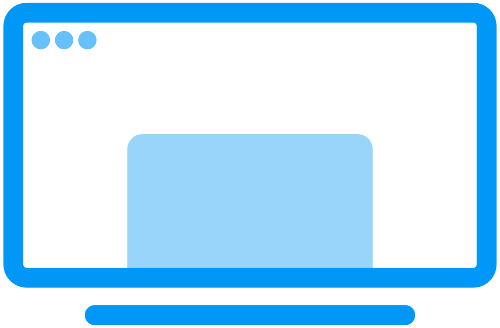

<!-- LOGO -->
<h1>
<p align="center">
  
  <br>DisplayOS
</h1>
  <p align="center">
    Build, boot, display.
    <br />
    <a href="#about">About</a>
    ·
    <a href="#features">Features</a>
    ·
    <a href="#keyboard-shortcuts">Keyboard Shortcuts</a>
    ·
    <a href="#quick-start">Quick Start</a>
    ·
    <a href="#license">License</a>
  </p>
</p>

<p align="center">
  <a href="https://github.com/OnlyDrey/DisplayOS/blob/main/LICENSE">
    
  </a>
  <a href="https://www.debian.org/">
    
  </a>
  
</p>

## About

**DisplayOS** is a lightweight, security-focused Linux distribution based on **Debian Bookworm**, built specifically for **digital signage and kiosk systems**.

The goal of DisplayOS is to provide a **predictable, unattended, and reproducible operating system** that boots directly into a fullscreen browser displaying a configurable URL. It is designed to operate without user interaction, package updates during installation, or ongoing maintenance, making it well-suited for long-running and controlled display environments.

DisplayOS is intentionally opinionated, using a **minimal desktop environment** and a **fully automated installer** to reduce complexity and minimize failure points. 

## Features

### Core Capabilities
- 🚀 **Fully unattended installer** - Preseeded Debian installer for zero-touch deployment
- 💿 **Offline installation** - Complete installation from live media, no network required
- 🔐 **Automatic login** - System boots directly to desktop without user interaction
- 🌐 **Browser kiosk mode** - Launches Firefox ESR or Chromium in fullscreen on startup
- 📺 **Configurable display URL** - Set any URL via `KIOSK_URL` environment variable
- 💾 **Optional auto-partitioning** - Destructive disk setup with explicit opt-in token
- 🔧 **SSH access** - Remote administration enabled by default (configurable)
- 🎯 **Reproducible builds** - Configuration-driven ISO generation for consistent deployments
- 🎨 **Custom branding** - Configurable product name and wallpapers

### Security Features
- Kernel hardening via sysctl
- Password hashing with SHA-512
- Configurable SSH access
- Minimal package footprint
- No automatic updates during installation

## Keyboard Shortcuts
| Shortcut | Action |
|--------|--------|
| `Ctrl+Alt+T` | Open terminal |
| `Ctrl+Alt+W` | Open Wi‑Fi configuration (`nmtui` in terminal) |

## Quick Start
### 1. Clone the repository
```bash
git clone https://github.com/OnlyDrey/DisplayOS.git && cd DisplayOS && chmod +x build.sh scripts/*.sh
```

### 2. Configure build variables

Edit the configuration file:
```bash
nano config.env
```

Common variables you may want to change:
```bash
# Kiosk Configuration
KIOSK_URL="https://example.com"               # URL to display in kiosk mode
DEFAULT_BROWSER="firefox-esr"                 # Browser: firefox-esr or chromium
KIOSK_AUTORESTART="yes"                       # Restart browser on crash

# Security & Authentication
ROOT_PASSWORD="change-me"                     # Admin password (or auto-generate)
ENABLE_SSH="yes"                              # Enable SSH server

# Localization
TIMEZONE="Europe/Oslo"                        # System timezone
LOCALE="en_US.UTF-8"                          # System locale
KEYMAP="no"                                   # Keyboard layout

```

You can also override variables at build time:
```bash
sudo KIOSK_URL="https://example.com" KIOSK_USER="kiosk" ./build.sh
```

> 🔐 **Security Note**
>
> The system creates a single administrator user with sudo privileges.
> - Set a strong `ROOT_PASSWORD` before production deployment
> - Or leave it empty with `GENERATE_ROOT_PASSWORD=yes` for automatic generation
> - The generated password will be displayed during build and saved in `output/configuration.txt`

### 3. (Optional) Enable automatic disk wipe
To allow the installer to automatically erase the target disk, use one of these methods:

**Method 1: With sudo -E flag (recommended)**
```bash
sudo -E ERASE_ALL_DATA_TOKEN=I_UNDERSTAND ./build.sh
```

**Method 2: Within sudo command**
```bash
sudo bash -c 'export ERASE_ALL_DATA_TOKEN=I_UNDERSTAND && ./build.sh'
```

**Method 3: Edit config.env directly**
```bash
nano config.env
# Change: ERASE_ALL_DATA_TOKEN=""
# To:     ERASE_ALL_DATA_TOKEN="I_UNDERSTAND"
sudo ./build.sh
```

Without this token, **no automatic partitioning will occur**. 

### 4. Build the ISO

**Method 1: Normal**
```bash
sudo ./build.sh
```

**Method 2: With variables**
```bash
sudo -E ERASE_ALL_DATA_TOKEN=I_UNDERSTAND ROOT_PASSWORD=change-me! KIOSK_URL=https://example.com ./build.sh
```

The resulting ISO will be placed in:
```text
output/DisplayOS-bookworm-amd64-unattended.iso
```

### Run in debug mode
```bash
sudo DEBUG=yes ./build.sh
```

This enables verbose logging and `live-build` debug output.

## Cleaning Between Builds
If you want a completely clean build:
```bash
sudo lb clean --purge
rm -rf cache/ chroot/ binary/ auto/ config/
```

Then re‑run:
```bash
sudo ./build.sh
```

## Default System Behavior

### Login & Desktop
- **User Account**: Single administrator user (`root`)
- **Auto-login**: Automatic login to `tty1` on boot
- **Desktop Environment**: XFCE4 starts automatically
- **Display**: Single workspace, no screen blanking

### Kiosk Mode
- **Browser**: Firefox ESR or Chromium (configurable)
- **Launch**: Fullscreen browser starts automatically on desktop load
- **URL**: Displays `KIOSK_URL` in kiosk mode
- **Auto-restart**: Optionally restart browser on crash
- **Wallpaper**: Custom background image support

### Network & Remote Access
- **SSH**: Enabled by default on port 22
- **Authentication**: Password or key-based authentication
- **Network Manager**: GUI available via keyboard shortcut

## Project Structure
```
DisplayOS/
├── config.env               # Configuration variables (edit this)
├── build.sh                 # Main build orchestrator
├── scripts/                 # Modular build scripts
│   ├── 00-init.sh           # Logging & debug setup
│   ├── 01-preflight.sh      # Pre-flight checks
│   ├── 02-prerequisites.sh  # Install build dependencies
│   ├── 03-password.sh       # Password generation/hashing
│   ├── 04-dump-config.sh    # Save config for traceability
│   ├── 05-config-tree.sh    # Prepare live-build config tree
│   ├── 06-hooks.sh          # Generate chroot hooks
│   ├── 07-preseed.sh        # Generate installer preseed
│   ├── 08-livebuild.sh      # Run live-build commands
│   └── 09-finalize.sh       # Collect artifacts
├── assets/                  # Wallpaper, splash, GRUB theme
│   ├── logo.png             # Project logo
│   ├── wallpaper.png        # Desktop/GRUB wallpaper
│   ├── splash.png           # Boot splash screen
│   └── grub.cfg             # GRUB menu configuration template
├── config/                  # Generated live-build config (do not edit)
└── output/                  # Build artifacts (ISO, logs)
    ├── DisplayOS-*.iso      # Final bootable ISO image
    ├── build.log            # Detailed build log
    └── configuration.txt    # Build configuration snapshot
```

## Use Cases

DisplayOS is designed for scenarios requiring reliable, unattended display systems:

- 📊 **Digital Signage** - Retail stores, airports, corporate lobbies
- 📈 **Dashboard Displays** - NOC monitoring, analytics dashboards, metrics visualization
- ℹ️ **Information Kiosks** - Public information terminals, wayfinding systems
- 🎓 **Educational Displays** - Classroom schedules, campus information boards
- 🏭 **Industrial HMI** - Factory floor displays, production monitoring
- 🎯 **Event Displays** - Conference schedules, event information screens

## System Requirements

### Minimum Requirements
- **Processor**: 64-bit x86 CPU (amd64 architecture)
- **RAM**: 2 GB (4 GB recommended)
- **Storage**: 10 GB available disk space
- **Graphics**: Any graphics card with framebuffer support
- **Boot**: UEFI or Legacy BIOS support

### Build System Requirements
- **OS**: Debian-based Linux distribution (Debian, Ubuntu, etc.)
- **Disk Space**: 15 GB free space for build process
- **Privileges**: Root access (via sudo)
- **Dependencies**: Automatically installed by build script

## Troubleshooting

### Build Issues

**Problem**: `lb: command not found`
```bash
# Solution: Install live-build
sudo apt-get update
sudo apt-get install live-build
```

**Problem**: Permission denied during build
```bash
# Solution: Ensure proper sudo usage
sudo ./build.sh
```

**Problem**: Out of disk space during build
```bash
# Solution: Clean previous builds
sudo lb clean --purge
rm -rf cache/ chroot/ binary/ auto/ config/
```

**Problem**: Installer doesn't auto-partition
```bash
# Solution: Enable auto-partitioning with the token
sudo -E ERASE_ALL_DATA_TOKEN=I_UNDERSTAND ./build.sh
```

## License

**DisplayOS** is free and open-source software licensed under the **GNU General Public License v3.0**.

This means you are free to:
- ✅ Use this software for any purpose
- ✅ Study and modify the source code
- ✅ Distribute copies of the software
- ✅ Distribute modified versions

**Under the following terms:**
- 📋 **Disclose Source** - Source code must be made available
- 📋 **License and Copyright Notice** - Include original license and copyright
- 📋 **Same License** - Modifications must be released under GPL-3.0
- 📋 **State Changes** - Document any changes made to the code

For the full license text, see the [LICENSE](LICENSE) file or visit:
https://www.gnu.org/licenses/gpl-3.0.html

### Third-Party Components

DisplayOS includes and builds upon:
- **Debian GNU/Linux** - Licensed under various open-source licenses
- **XFCE Desktop Environment** - GPL and LGPL licenses
- **Firefox ESR / Chromium** - MPL 2.0 / BSD licenses
- **live-build** - GPL-3.0 license

## Acknowledgments

Built with:
- 🐧 [Debian GNU/Linux](https://www.debian.org/)
- 🔨 [live-build](https://wiki.debian.org/DebianLive)
- 🖥️ [XFCE Desktop Environment](https://www.xfce.org/)
- 🌐 [Firefox ESR](https://www.mozilla.org/firefox/enterprise/)

<p align="center">
  <a href="https://github.com/OnlyDrey/DisplayOS">⭐ Star this repository</a> if you find it useful!
</p>
